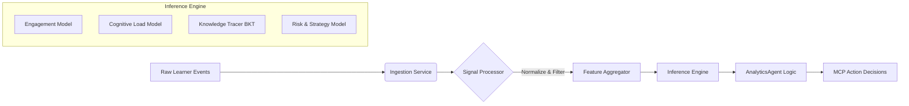

# Lumina Analytics Agent — Project Manual

**Version:** 1.0.0
**Status:** Verified & Calibrated Release Candidate (v1.0)

---

## 1. Project Overview

The **Lumina Analytics Agent** is an autonomous, privacy-first intelligence system designed to model learner behavior in real-time. Unlike traditional analytics dashboards that report *what* happened, this agent acts as a cognitive psychologist to understand *why* it happened and *what* to do next.

It operates as a core microservice within the Lumina platform, collaborating with other agents (Tutor, Pathway, Intervention) via the **Model Context Protocol (MCP)**.

### Core Philosophy
1.  **Privacy-First:** Operates on self-hosted infrastructure (TimescaleDB abstraction mocked to simulate time-series persistence in prototype).
2.  **Causal Reasoning:** Prioritizes learning growth and mastery over superficial metrics like "time on site."
3.  **Agentic Architecture:** Not just a model, but an agent with internal state, memory, and decision-making capabilities.

---

## 2. System Architecture

The agent follows a rigorous **Signal-to-Insight Pipeline**:



### Components
-   **Ingestion Service**: Validates incoming JSON streams (`analytics_agent/services/ingestion.py`).
-   **Signal Processor**: Removes noise (idle time) and normalizes input intensities per learner (`analytics_agent/core/signal_processor.py`).
-   **Inference Engine**:
    -   *Engagement*: XGBoost-style weighted feature scoring (model logic mocked for prototype).
    -   *Cognitive*: Heuristic estimation of load and fatigue.
    -   *Knowledge*: Bayesian Knowledge Tracing (BKT) for concept mastery.
-   **Agent Core**: Orchestrates the loop and generates MCP signals (`analytics_agent/agents/analytics/agent.py`).

---

## 3. Key Capabilities

### A. Engagement Intelligence
-   **Score (0-1)**: Real-time measure of active learning.
-   **Trend Detection**: Automatically flags if engagement is `increasing`, `stable`, or `declining`.
-   **Differentiation**: Distinguishes "Frantic Struggle" (high intensity, low success) vs. "Flow" (steady intensity, high success).

### B. Cognitive Modeling
-   **Load Estimation**: Infers if a learner is in `optimal` flow or `overload`.
-   **Fatigue Detection**: Identifies burnout risks based on session duration and performance efficacy.
-   **Time-of-Day Calibration**: Adjusts expectations based on learner's circadian markers.

### C. Predictive Intervention
-   **Dropout Risk**: Forecasts likelihood of quitting based on engagement trends.
-   **Strategy Detection**: Classifies behavior as `visual_learner`, `active_recall`, etc.
-   **MCP Signals**:
    -   `DIFFICULTY_ADJUSTMENT`: Recommends harder/easier content.
    -   `INTERVENTION_REQUIRED`: Alerts human or bot coaches.

### D. Agent State Variables
The agent maintains a persistent internal state model:
-   `engagement_history`: Time-series of engagement scores.
-   `mastery_state`: Probabilistic map of concept mastery (0.0 - 1.0).
-   `fatigue_index`: Cumulative load measure.
-   `risk_score`: Composite probability of dropout/failure.
-   `last_action_timestamp`: Cooldown tracker for MCP signals.

---

## 4. Project Structure

```text
/analytics_agent
    /agents/analytics
        agent.py            # Core Agent Class (The Brain)
        schema.py           # Pydantic Models & State Constraints
        mcp_contract.py     # Protocol Definitions for Agent Communication
    /core
        signal_processor.py # Normalization & Noise Filtering
        aggregator.py       # Time-window Feature Engineering
    /models
        engagement.py       # Engagement Scoring Logic
        cognitive.py        # Cognitive Load & Fatigue Logic
        knowledge.py        # Bayesian Knowledge Tracing
        prediction.py       # Risk & Strategy Models
    /db
        storage.py          # TimescaleDB Abstraction (Mock)
    /services
        ingestion.py        # Data Ingestion Pipeline

/tests                      # Full Pytest Suite covering all modules
/docs                       # Detailed System Prompts & Mechanics
    MASTER_PROMPT.md        # The Authoritative System Prompt
/run_agent.py               # Demonstration Script
/simulation.py              # 100-Iteration Stress Test Script
```

---

## 5. Usage & Execution

### Prerequisites
-   Python 3.9+
-   Dependencies: `pydantic`, `numpy` (Standard scientific stack)

### Running a Demonstration
To see the agent process singular scenarios (Struggling Learner vs. Flow State):
```bash
python run_agent.py
```
This outputs the full JSON decision tree and any MCP actions triggered.

### Running a Large-Scale Simulation
To stress-test the system with 100 randomized sessions:
```bash
python simulation.py
```
This generates an aggregate statistical report of engagement scores and intervention rates.

### Running Tests
To verify system integrity:
```bash
pytest
```

---

## 6. Customization

-   **System Prompt**: Edit `docs/MASTER_PROMPT.md` to change the agent's persona or high-level directives.
-   **Model Parameters**: Tweak thresholds (e.g., `idle_threshold_seconds`) in `analytics_agent/core/signal_processor.py` or model weights in `analytics_agent/models/`.

---

## 7. Evaluation & Validation

The agent is evaluated on:
-   **Engagement Inference Quality**: Correlation with manual ground-truth labels.
-   **Cognitive State Consistency**: Stability of load estimation under noise.
-   **Predictive Lead Time**: How far in advance dropout is predicted.
-   **Intervention Effectiveness**: Learning gain after triggered actions.
-   **Stability**: Robustness against erratic input jitter.

## 8. Ethical & Safety Considerations

-   **No Irreversible Actions**: The agent recommends; it does not block or ban.
-   **Confidence Thresholds**: Alerts are suppressed if confidence < 0.7.
-   **Human-in-the-loop**: High-severity risks escalate to human review.
-   **Audit Logging**: Every MCP decision is logged with `reasoning` and `confidence` tokens.

---

**Developed for Lumina Learning**
*Advanced Agentic Coding Team*
